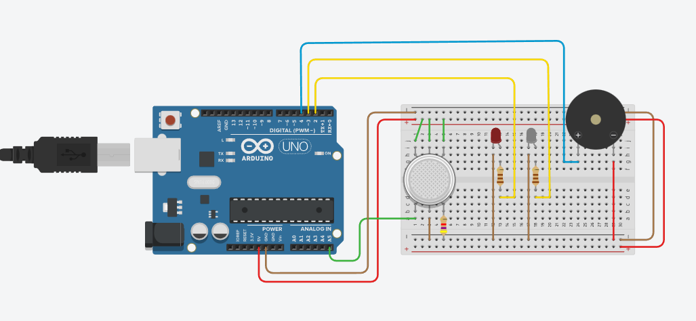
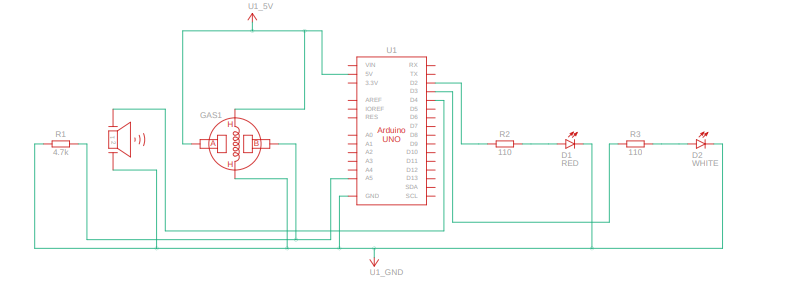

# GAS_SENSOR Project

## Overview
This project implements a gas sensor system using an analog gas sensor connected to an Arduino. The system monitors gas levels and triggers alerts when the gas concentration exceeds a predefined threshold.

## Features
- Reads gas sensor data from pin `A5`.
- Activates a white LED and buzzer when gas levels exceed the threshold.
- Displays gas sensor readings on the serial monitor.
- Red LED indicates normal conditions.

## Components Used
- Gas sensor (connected to pin `A5`)
- Red LED (connected to pin `2`)
- White LED (connected to pin `3`)
- Buzzer (connected to pin `4`)
- Arduino board

## Circuit Diagram
The circuit diagram for the GAS_SENSOR project is provided in the file `Gas_Sensor.png`. It visually represents the connections between the gas sensor, LEDs, buzzer, and Arduino board.

## Schematic View
The schematic view of the project is available in the file `Gas_Sensor_SV.png`. It provides a simplified representation of the system's components and their interactions.

## Code Description
The code initializes the gas sensor and LEDs, reads the gas sensor values, and compares them against a threshold value. If the gas concentration exceeds the threshold:
- The white LED is turned on.
- The buzzer emits a tone.
Otherwise:
- The red LED is turned on.
- The buzzer remains silent.

## How to Run
1. Connect the components as described in the code.
2. Upload the code from [Gas_Sensor.txt](Gas_Sensor.txt) to the Arduino.
3. Open the serial monitor to view gas sensor readings.

## Threshold Value
The threshold value for gas concentration is set to `400`. You can adjust this value in the code based on your requirements.

## File Structure
- `Documentation/Gas_Sensor.txt`: Contains the source code for the gas sensor system.
- `Hardware/`: Placeholder for hardware-related files.
- `Firmware/`: Placeholder for firmware-related files.

## Notes
- Ensure proper calibration of the gas sensor before use.
- Test the system in a controlled environment to verify functionality.