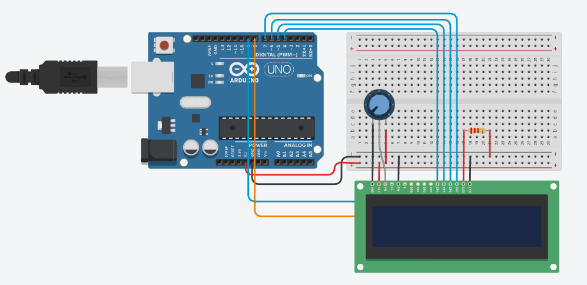
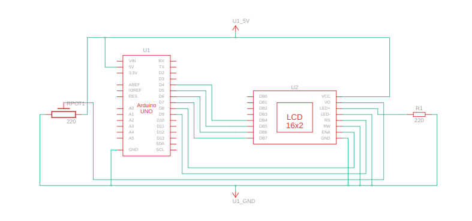

# LCD_DISPLAY Project

## Overview
This project implements an LCD display system using a 16x2 LCD connected to an Arduino. The system displays custom messages and updates dynamically based on user input or sensor data.

## Features
- Displays text messages on a 16x2 LCD.
- Supports dynamic updates to the displayed content.
- Easy integration with other sensors or modules for real-time data display.

## Components Used
- 16x2 LCD display (connected via I2C or parallel interface)
- Arduino board

## Circuit Diagram
The circuit diagram for the LCD_DISPLAY project is provided in the file `LCD_Display.png`. It visually represents the connections between the LCD display and the Arduino board.

## Schematic View
The schematic view of the project is available in the file `LCD_Display_SV.png`. It provides a simplified representation of the system's components and their interactions.

## Code Description
The code initializes the LCD display and sets up communication with the Arduino. It allows for dynamic updates to the displayed content based on user input or sensor data. The system can be extended to display real-time data from external modules.

## How to Run
1. Connect the components as described in the code.
2. Upload the code from [LCD_Display.txt](LCD_Display.txt) to the Arduino.
3. Observe the messages displayed on the LCD.

## File Structure
- `Documentation/LCD_Display.txt`: Contains the source code for the LCD display system.
- `Hardware/`: Placeholder for hardware-related files.
- `Firmware/`: Placeholder for firmware-related files.

## Notes
- Ensure proper wiring of the LCD display to the Arduino.
- Test the system with sample messages before integrating with other modules.