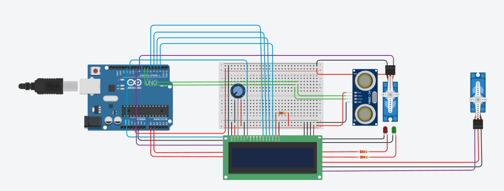
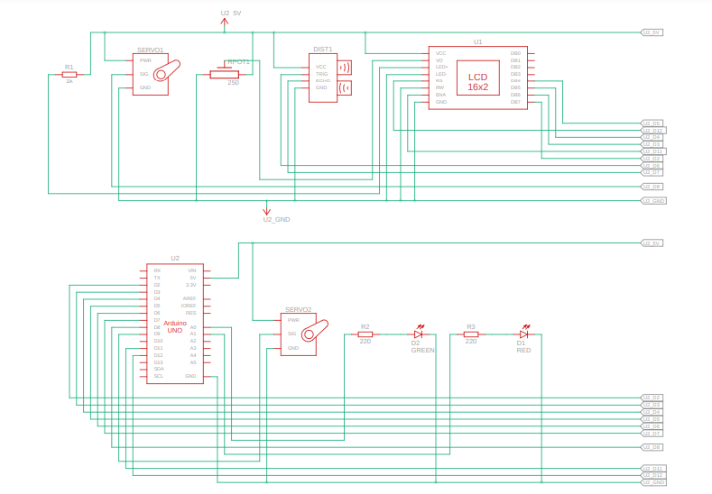

# Mini_Project1

## Overview
This project integrates multiple sensors and modules connected to an Arduino to perform various tasks such as monitoring environmental parameters, controlling actuators, and displaying data.

## Features
- Combines gas, ultrasonic, and temperature sensors.
- Controls actuators like LEDs and servo motors.
- Displays data on an LCD or serial monitor.
- Configurable thresholds for alerts and actions.

## Components Used
- Ultrasonic sensor (e.g., HC-SR04)
- Servo motor
- 16x2 LCD display
- LEDs (red, yellow, green)
- Arduino board
- Jumper wires
- Breadboard
- Potentiometer

## Circuit Diagram
The circuit diagram for Mini_Project1 is provided in the file `Mini_Project1_Circuit.png`. It visually represents the connections between all components and the Arduino board.

## Schematic View
The schematic view of the project is available in the file `Mini_Project1_Schematic.png`. It provides a simplified representation of the system's components and their interactions.

## Code Description
The code initializes all sensors and modules, reads data from the sensors, and performs actions based on predefined thresholds. It controls actuators such as LEDs and servo motors, and displays data on an LCD or serial monitor.

## How to Run
1. Connect the components as described in the circuit diagram.
2. Upload the code from [Mini_Project1.txt](Mini_Project1.txt) to the Arduino.
3. Observe the system's behavior and data output on the LCD or serial monitor.

## File Structure
- `Documentation/Mini_Project1.txt`: Contains the source code for the project.
- `Hardware/`: Contains hardware-related files such as schematics and diagrams.
- `Firmware/`: Contains firmware-related files for the Arduino.

## Notes
- Ensure proper wiring and calibration of all sensors before use.
- Test the system in a controlled environment to verify functionality.
- Adjust threshold values in the code as needed for specific applications.