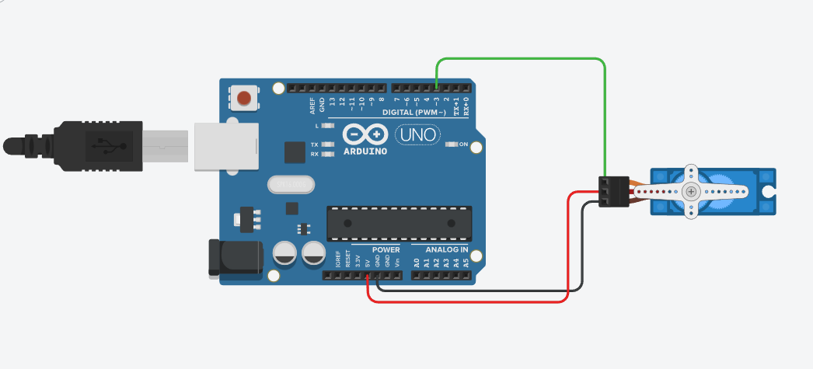
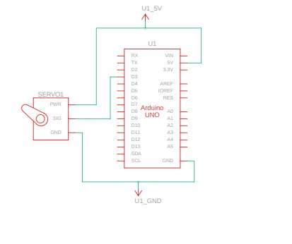

# SERVO_MOTOR Project

## Overview
This project implements a servo motor control system using an Arduino. The system allows precise control of the servo motor's position based on user input or sensor data.

## Features
- Controls the position of a servo motor.
- Supports dynamic angle adjustments.
- Easy integration with other sensors or modules for automated control.

## Components Used
- Servo motor (connected to pin `3`)
- Arduino board

## Circuit Diagram
The circuit diagram for the SERVO_MOTOR project is provided in the file `Servo_Motor.png`. It visually represents the connections between the servo motor and the Arduino board.

## Schematic View
The schematic view of the project is available in the file `Servo_Motor_SV.png`. It provides a simplified representation of the system's components and their interactions.

## Code Description
The code initializes the servo motor and sets up communication with the Arduino. It allows for dynamic control of the motor's position based on user input or sensor data. The system can be extended to automate movements based on external modules.

## How to Run
1. Connect the components as described in the code.
2. Upload the code from [Servo_Motor.txt](Servo_Motor.txt) to the Arduino.
3. Observe the servo motor's movement based on the input.

## File Structure
- `Documentation/Servo_Motor.txt`: Contains the source code for the servo motor control system.
- `Hardware/`: Placeholder for hardware-related files.
- `Firmware/`: Placeholder for firmware-related files.

## Notes
- Ensure proper wiring of the servo motor to the Arduino.
- Test the system with sample angle adjustments before integrating with other modules.