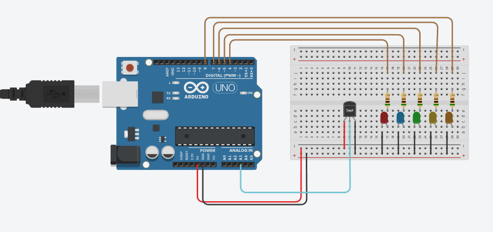
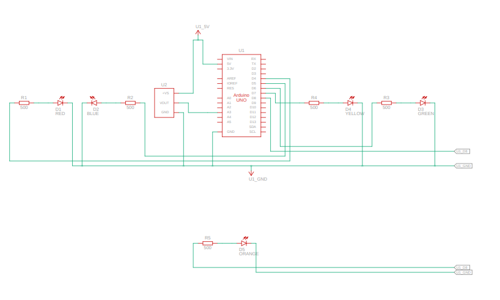

# TEMPERATURE_SENSOR Project

## Overview
This project implements a temperature monitoring system using a temperature sensor connected to an Arduino. The system reads temperature data and displays it on an LCD or serial monitor.

## Features
- Reads temperature data from a sensor (e.g., LM35 or DHT11).
- Displays temperature readings on an LCD or serial monitor.
- Supports alerts for temperature thresholds.

## Components Used
- Temperature sensor (e.g., LM35 or DHT11, connected to pin `A3`)
- Arduino board

## Circuit Diagram
The circuit diagram for the TEMPERATURE_SENSOR project is provided in the file `Temperature_Sensor.png`. It visually represents the connections between the temperature sensor and the Arduino board.

## Schematic View
The schematic view of the project is available in the file `Temperature_Sensor_SV.png`. It provides a simplified representation of the system's components and their interactions.

## Code Description
The code initializes the temperature sensor and reads temperature data. It displays the readings on an LCD or serial monitor and can trigger alerts if the temperature exceeds a predefined threshold.

## How to Run
1. Connect the components as described in the code.
2. Upload the code from [Temperature_Sensor.txt](Temperature_Sensor.txt) to the Arduino.
3. Observe the temperature readings on the LCD or serial monitor.

## File Structure
- `Documentation/Temperature_Sensor.txt`: Contains the source code for the temperature monitoring system.
- `Hardware/`: Contains hardware-related files such as schematics and diagrams.
- `Firmware/`: Contains firmware-related files for the Arduino.

## Notes
- Ensure proper calibration of the temperature sensor before use.
- Test the system in a controlled environment to verify functionality.
- Adjust the threshold values in the code as needed for specific applications.