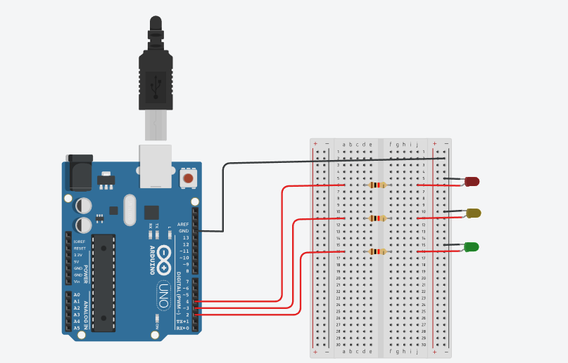
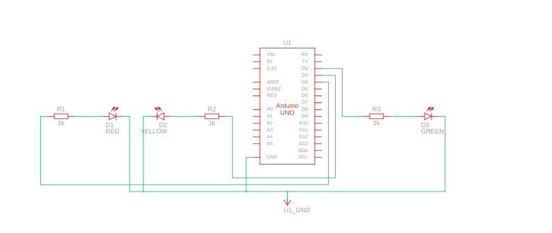

# TRAFFIC_LIGHT Project

## Overview
This project implements a traffic light system using LEDs connected to an Arduino. The system simulates the operation of a standard traffic light with red, yellow, and green LEDs.

## Features
- Controls red, yellow, and green LEDs to simulate traffic light behavior.
- Configurable timing for each light phase.
- Easy integration with sensors for advanced traffic control.

## Components Used
- Red LED (connected to pin `2`)
- Yellow LED (connected to pin `3`)
- Green LED (connected to pin `4`)
- Arduino board

## Circuit Diagram
The circuit diagram for the TRAFFIC_LIGHT project is provided in the file `Traffic_Light.png`. It visually represents the connections between the LEDs and the Arduino board.

## Schematic View
The schematic view of the project is available in the file `Traffic_Light_SV.png`. It provides a simplified representation of the system's components and their interactions.

## Code Description
The code initializes the LEDs and controls their behavior to simulate a traffic light. Each LED is turned on and off based on predefined timing intervals to represent the red, yellow, and green phases.

## How to Run
1. Connect the components as described in the code.
2. Upload the code from [Traffic_Light.txt](Traffic_Light.txt) to the Arduino.
3. Observe the traffic light simulation with the LEDs.

## File Structure
- `Documentation/Traffic_Light.txt`: Contains the source code for the traffic light system.
- `Hardware/`: Placeholder for hardware-related files.
- `Firmware/`: Placeholder for firmware-related files.

## Notes
- Ensure proper wiring of the LEDs to the Arduino.
- Test the system in a controlled environment to verify functionality.