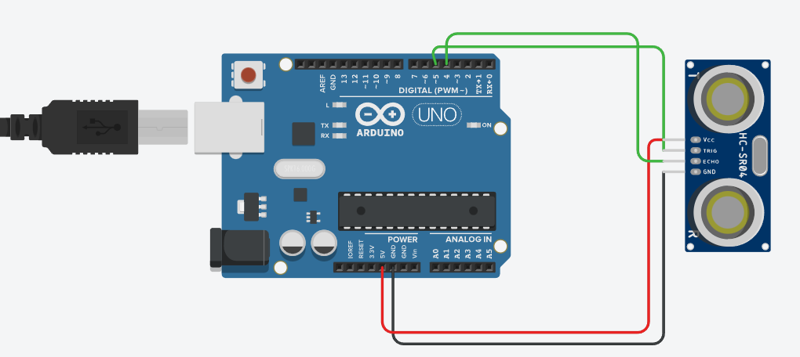
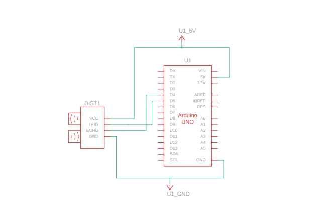

# ULTRASONIC_SENSOR Project

## Overview
This project implements a distance measurement system using an ultrasonic sensor connected to an Arduino. The system calculates the distance to an object and displays it on an LCD or serial monitor.

## Components Used
- Ultrasonic sensor (e.g., HC-SR04)
- Arduino board
- Jumper wires
- Breadboard
- LCD display (optional, for visual output)
- Resistors (if required for connections)

## Circuit Diagram
The circuit diagram for the ULTRASONIC_SENSOR project is provided in the file `Ultrasonic_Sensor.png`.

## Schematic View
The schematic view of the project is available in the file `Ultrasonic_Sensor_SV.png`.

## How to Run
1. Connect the components as described in the code.
2. Upload the code from [Ultrasonic_Sensor.txt](Ultrasonic_Sensor.txt) to the Arduino.
3. Observe the distance readings on the LCD or serial monitor.

## File Structure
- `Documentation/Ultrasonic_Sensor.txt`: Contains the source code for the distance measurement system.
- `Hardware/`: Contains hardware-related files.
- `Firmware/`: Contains firmware-related files.

## Notes
- Ensure proper alignment of the ultrasonic sensor for accurate readings.
- Test the system in a controlled environment to verify functionality.